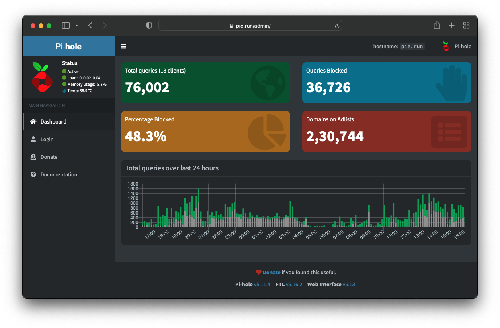

# Ansible Setup Playbooks

> _Ansible playbooks to setup dev environments and home servers_

- [Ansible Setup Playbooks](#ansible-setup-playbooks)
  - [Installation](#installation)
  - [Playbooks](#playbooks)
    - [rpi](#rpi)
      - [Pi-hole](#pi-hole)
      - [Internet Monitoring](#internet-monitoring)
    - [macOS](#macos)
  - [References](#references)

## Installation

```bash
git clone https://github.com/nirantak/ansible-setup.git
cd ansible-setup
python3 -m venv .venv
source .venv/bin/activate
pip install -U -r requirements.txt
ansible-galaxy collection install -r requirements.yml

# To set up pre-commit hooks, required for contributing code, run:
pre-commit install --install-hooks --overwrite
```

Update the following files to your liking:

- `inventory.ini` (replace IP address with your server's IP, or use `127.0.0.1` and add `connection=local` at the end if you're running it on the machine you're setting up).
- `group_vars/<group>.yml` to update the config for any host group from the inventory.

## Playbooks

### rpi

> _Raspberry Pi setup and config for all things Internet_

```bash
# To run the entire setup:
ansible-playbook playbooks/raspberry-pi.yml -k
# Only use the `-k` flag the first time, so that you can enter the ssh password.
# This is not needed once key-based ssh is setup.

# Or run select tasks or roles using tags:
ansible-playbook playbooks/raspberry-pi.yml -k -t ping
```

For backup for Pi-hole at least, in the GUI you can go to Settings > Teleporter and click 'Backup'. To automate it through the console, you can run `pihole -a -t`.

#### Pi-hole

Installs the Pi-hole for network-wide ad-blocking and local DNS. Make sure to update your network router config to direct all DNS queries through your Raspberry Pi if you want to use Pi-hole effectively.

**Pi-hole**: Visit the Pi's IP address (e.g. http://192.168.1.40/) and use the `pihole_password` you configured in your `config.yml` file.



#### Internet Monitoring

Installs Prometheus and Grafana, along with a few Docker containers to monitor your Internet connection with Speedtest.net and HTTP tests so you can see uptime, ping stats, and speed-test results over time.
Note: If you use the included Internet monitoring, it will download a decently-large amount of data through your Internet connection on a daily basis. If you have a metered connection, don't use it, or tune the `internet-monitoring` setup to not run the speedtests as often.

**Grafana**: Visit the Pi's IP address with port 3030 (e.g. http://192.168.1.40:3030/), and log in with username `admin` and the password `monitoring_grafana_admin_password` you configured in your `config.yml`.


### macOS

> _Mac dev env setup and configuration_

## References

- https://github.com/geerlingguy/internet-pi
- https://github.com/geerlingguy/mac-dev-playbook
